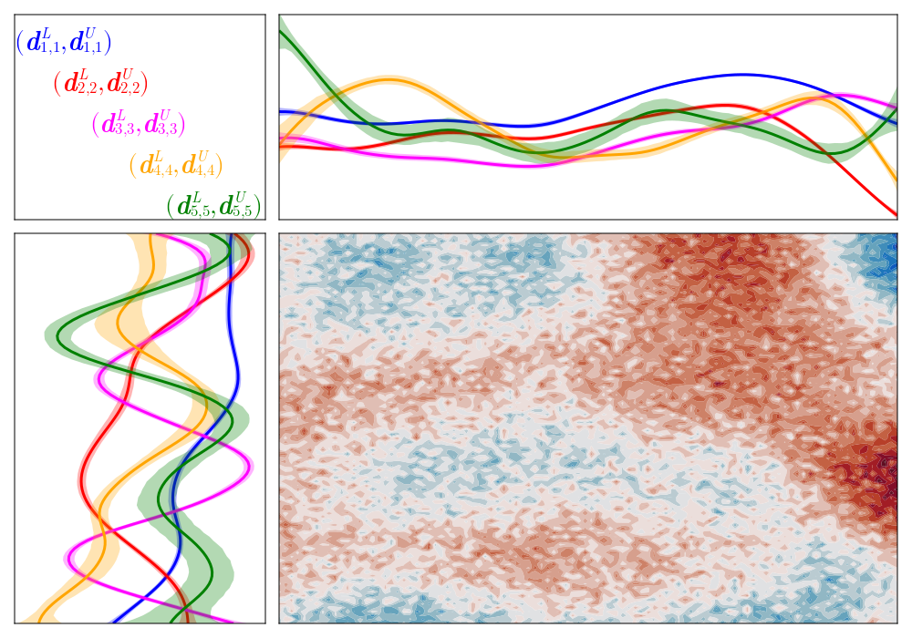

# BayesianSVD.jl

[](https://jsnowynorth.github.io/BayesianSVD.jl/stable/)
[](https://jsnowynorth.github.io/BayesianSVD.jl/dev/)
[](https://github.com/jsnowynorth/BayesianSVD.jl/actions/workflows/CI.yml?query=branch%3Amain)
[](http://codecov.io/github/jsnowynorth/BayesianSVD.jl?branch=main)

A package for implimenting the Bayesian SVD model from ``A flexible class of priors for orthonormal matrices with basis function-specific structure'', which can be found at [https://arxiv.org/abs/2307.13627](https://www.sciencedirect.com/science/article/pii/S2211675324000575).
To install the package, clone the repository from GitHub and place it in your `/.julia/dev/` folder, navigate to the folder, and run 
```
julia> ] dev .
```
This will make the package callable via the `using BayesianSVD` command.



